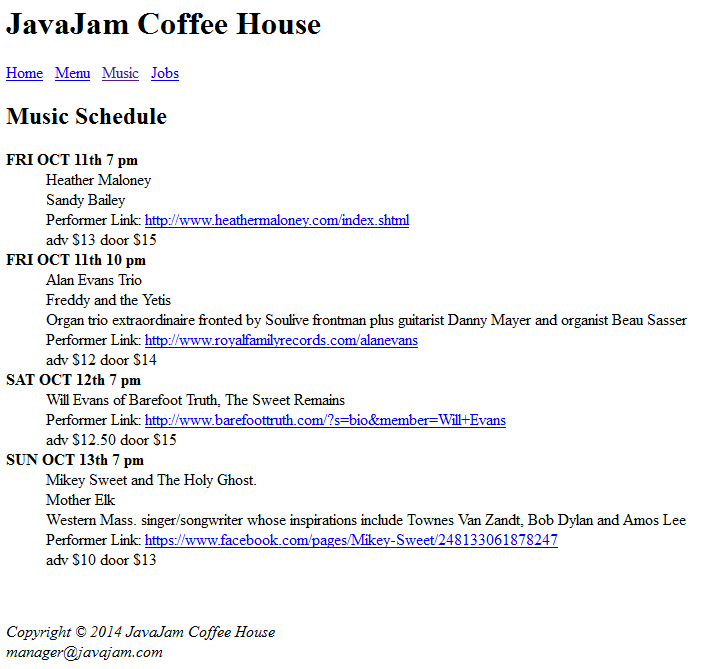

# Part 1 Challenge

You are creating a website for a Coffee House. Make 4 pages like the following.  

You will create a new folder for this called javajam. Also create a folder called trillium and put all your trillium files in there

You should start the project by creating an `index.html` in the javajam folder with the code from running the `html:5` command

## index.html

## menu.html

## music.html

## jobs.html

## Done

Great job. Make sure you create a commit with the commit message `feat: Complete Part 1 Challenge`.

You are now ready to tackle [Part-II](../../part-II)
